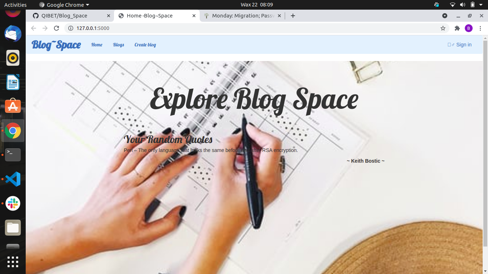

# Project Title
### Pitch~Ground
# Description
Is a web application that allows one to create a blog, comment on a blog and view random quotes on the home page
# BDD [MVP]
 * Allows a user to view blogs they have posted.
 * Allows a user to view random quotes on the gome page
 * Allows a user to register and blog as a writer.

 # Screenshot of application landing page

# SetUp / Installation Requirements
### You need to have the following
    * Python3.6 upwards
    * Flask
    * virtualenv
    * Pip
# Technologies Used
    * Python
    * Flask
    * Flask-Boot-strap
    * Flask-Script

# Support and contact details 
Incase of any bottlenecks or challenges, Kindly reach us on Email: bernardonline88@gmail.com 
 * Feel free to clone the repo on Github access link: https://github.com/QIBET/Blog_Space

